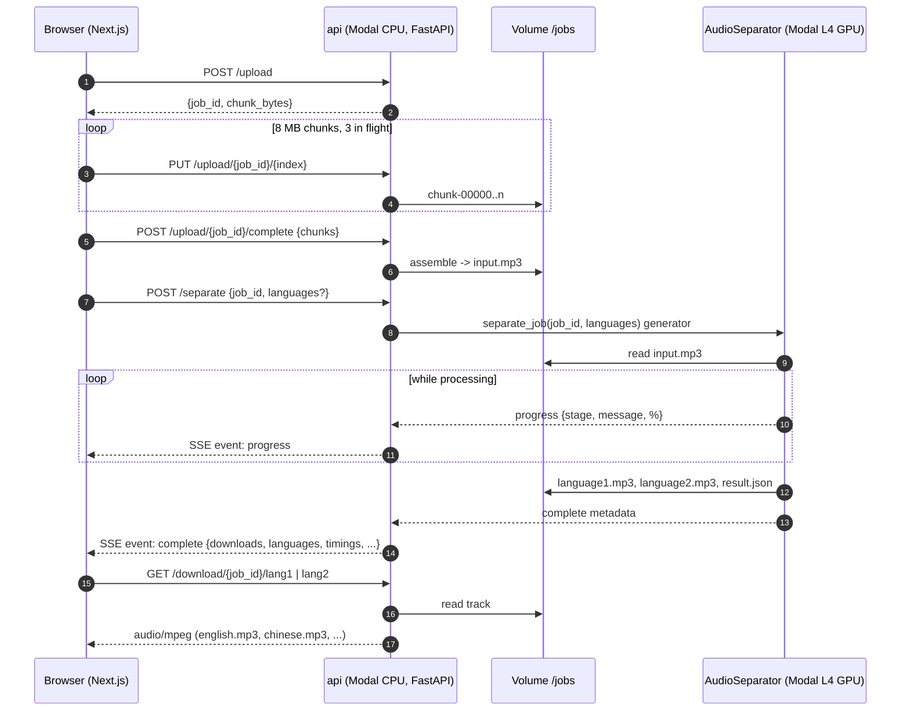
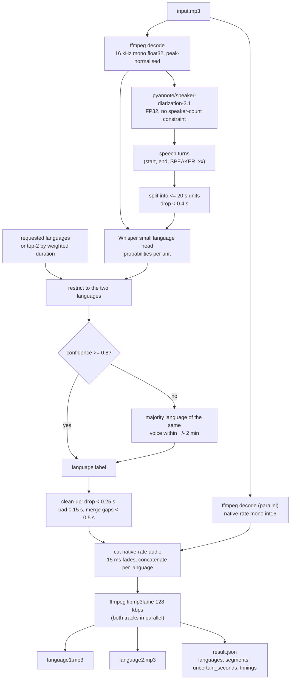

# Interpret - Bilingual Audio Separator

A web application for splitting bilingual sermons into two clean language-only audio tracks.

## Overview

Interpret allows users to upload an MP3 file containing bilingual audio (e.g., sermons with interpretation) and automatically separates it into two clean audio tracks - one for each language. pyannote.audio speaker diarization finds *when* someone is speaking and where the turns change; Whisper's language-identification head decides *which language* each turn is in.

## How It Works

### Request Flow



### Audio Pipeline (inside the GPU worker)



### High-Level Flow

1. **Upload**: User drops an MP3 file; the browser uploads it in 8 MB chunks (`POST /upload`, `PUT /upload/{job}/{n}`, `POST /upload/{job}/complete`) into a shared Modal Volume
2. **Process**: `POST /separate` with `{job_id, languages: ["en", "zh"]}` (languages optional) streams progress over SSE while an L4 GPU works
3. **Diarize**: pyannote.audio finds every speech turn
4. **Identify**: Whisper labels each turn with its spoken language
5. **Return**: The `complete` event carries only metadata (languages, timings, segments) and two download paths
6. **Download**: Browser fetches each track directly from `GET /download/{job}/{lang1|lang2}` (named `english.mp3`, `chinese.mp3`, ...); jobs expire after 24 h

### Audio Processing Pipeline (Modal GPU)

The core separation happens in `run-service/modal_app.py`:

1. **Decode** (ffmpeg)
   - One 16 kHz mono float32 copy, peak-normalised, for the diarization model
   - One mono int16 copy at the file's **native sample rate** for the output tracks (decoded in parallel with diarization)

2. **Speaker Diarization** (pyannote/speaker-diarization-3.1)
   - Neural network identifies "who spoke when" with no constraint on the number of voices
   - Outputs timestamped turns: `[(0.5s, 3.2s, SPEAKER_00), (3.2s, 8.1s, SPEAKER_01), ...]`
   - Runs in FP32 (mixed precision corrupts the speaker embeddings), batch size 64

3. **Language Identification** (Whisper `small`)
   - Turns are split into <= 20 s units; units shorter than 0.4 s are ignored
   - Whisper's language head scores every unit; the scores are restricted to the two
     requested languages (or, if none/one is given, to the two most-spoken languages in the file)
   - Units the model is unsure about (< 0.8) take the language their voice speaks most in the
     surrounding two minutes

4. **Timeline Clean-up**
   - Drop segments shorter than 0.25 s (back-channels, glitches)
   - Pad every segment by 0.15 s so word edges are not clipped
   - Merge same-language segments separated by less than 0.5 s

5. **Track Building**
   - Slice the native-rate audio for each segment and apply a 15 ms fade at every cut
   - Concatenate all segments per language into continuous tracks

6. **MP3 Export**
   - Both tracks encoded in parallel with ffmpeg/libmp3lame at 128 kbps, at the native sample rate

**Why language, not voice?** Real recordings often have more than two voices (a second
preacher, a change of interpreter, an announcer) and a diarizer clusters by *voice*, so
"2 speakers = 2 languages" routes whole passages to the wrong track. Labelling each turn
by language makes the number of speakers irrelevant. Overlapping speech (the interpreter
starting before the preacher finishes) is included in both tracks.

## Architecture

- **Frontend**: Next.js 16 with React 19, Tailwind CSS v4
- **GPU Processing**: Modal serverless GPU (L4) with pyannote.audio diarization + Whisper language ID
- **Communication**: Direct client-to-Modal API

## Getting Started

### Prerequisites

- Node.js 18+
- npm or yarn
- [Modal](https://modal.com) account (for GPU processing)
- HuggingFace account with access to pyannote models

### Local Development

1. **Install frontend dependencies**:
   ```bash
   npm install
   ```

2. **Configure environment**:
   ```bash
   cp .env.example .env.local
   ```

   Fill in your Modal endpoint URL after deployment.

3. **Deploy Modal service**:
   ```bash
   cd run-service
   modal secret create huggingface HUGGING_FACE_TOKEN=hf_your_token
   modal deploy modal_app.py
   ```

   Copy the `api` web endpoint URL (e.g. `https://<workspace>--audio-separator-api.modal.run`) to your `.env.local`.
   Note: the endpoint URL changes with this release — the old `.../audioseparator-separate.modal.run` URL no longer exists.

   To test the service without the frontend:
   ```bash
   modal run modal_app.py --path ./sermon.mp3 --out-dir ./out --languages en,zh
   ```

4. **Run development server**:
   ```bash
   npm run dev
   ```

5. **Open browser**:
   Visit [http://localhost:3000](http://localhost:3000)

## Project Structure

```
interpret/
├── app/                          # Next.js app directory
│   ├── page.tsx                  # Main page: MP3 drop zone, progress, downloads
│   ├── layout.tsx                # Root layout
│   └── globals.css               # Global styles (Tailwind v4)
├── components/                   # React components
│   └── ui/
│       ├── input.tsx             # Input component
│       └── simple-growth-tree.tsx # Animated tree visualization
├── lib/                          # Utility functions
│   ├── types.ts                  # TypeScript interfaces
│   └── utils.ts                  # General utilities (cn helper)
├── run-service/                  # Modal GPU service
│   ├── modal_app.py              # AudioSeparator class: pyannote diarization + Whisper language ID
│   └── requirements.txt          # Python dependencies
└── .env.local                    # Local environment variables
```
## Technology Stack

### Frontend
- **Next.js 16** - React framework with App Router
- **React 19** - UI library
- **Tailwind CSS v4** - Utility-first CSS
- **Framer Motion** - Animation library
- **React Dropzone** - File upload handling
- **TypeScript** - Type safety

### GPU Processing Service
- **Modal** - Serverless GPU platform
- **Python 3.10** - Programming language
- **pyannote.audio 3.1** - Speaker diarization
- **openai-whisper** - Spoken-language identification
- **PyTorch + CUDA** - GPU acceleration
- **ffmpeg** - Audio decoding and MP3 export

## Environment Variables

```bash
NEXT_PUBLIC_MODAL_ENDPOINT=https://your-modal-endpoint.modal.run
HUGGING_FACE_TOKEN=hf_your_token  # For Modal secret
```
